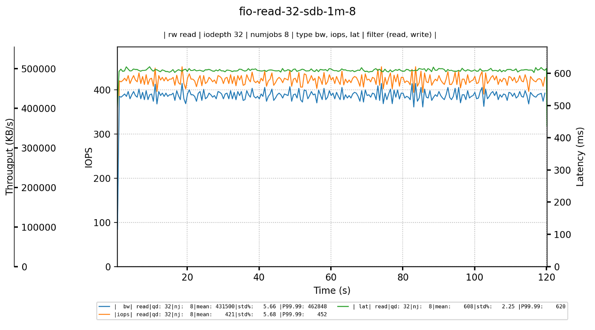
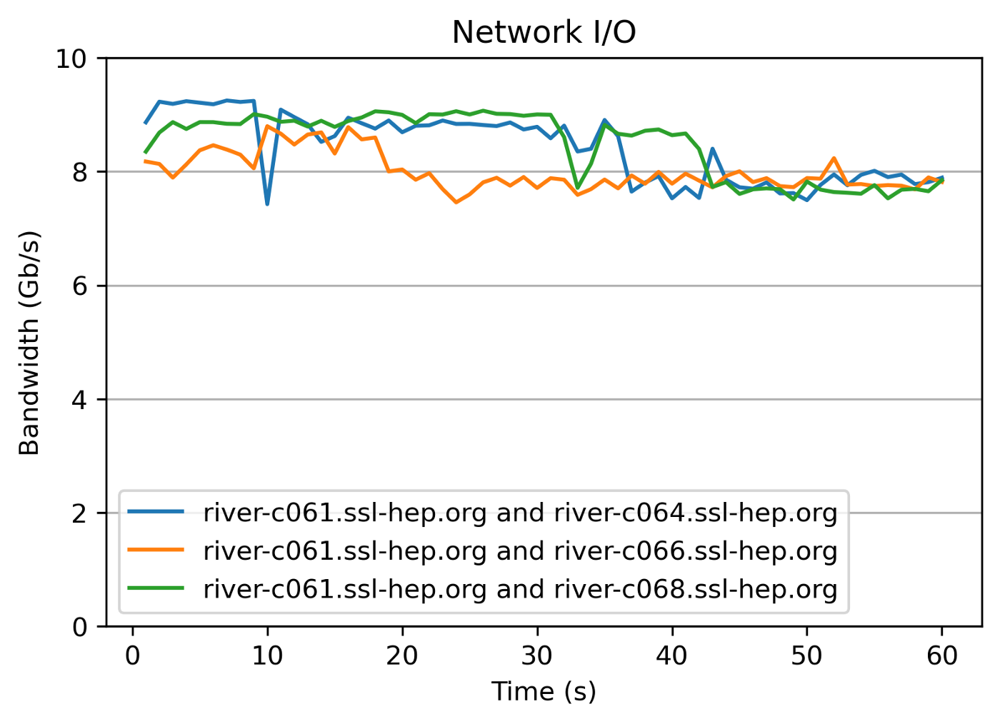
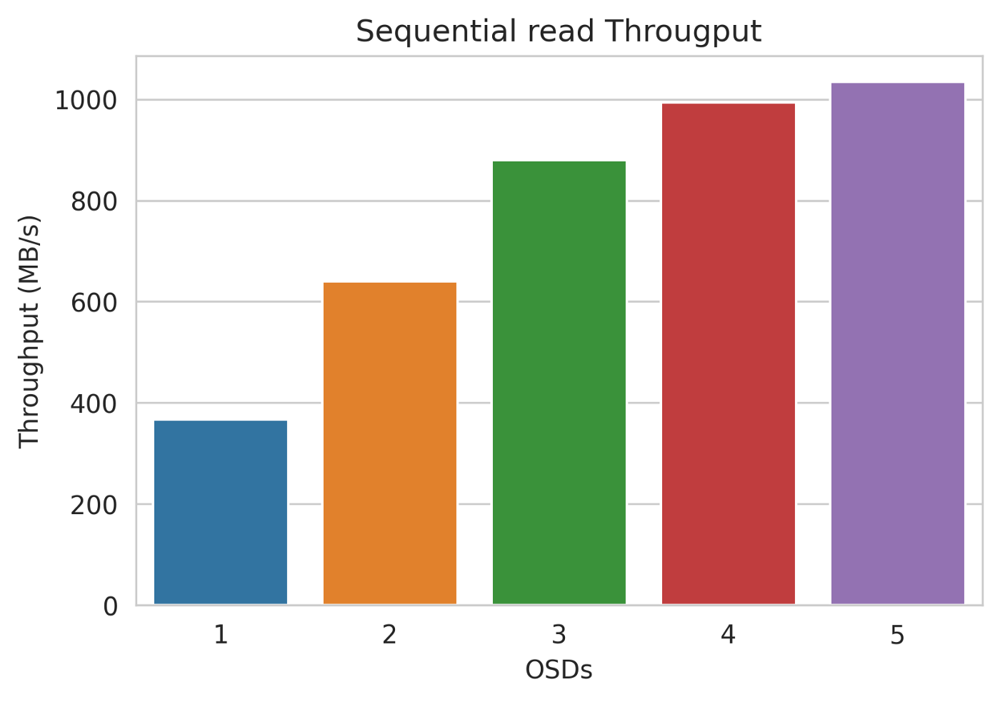
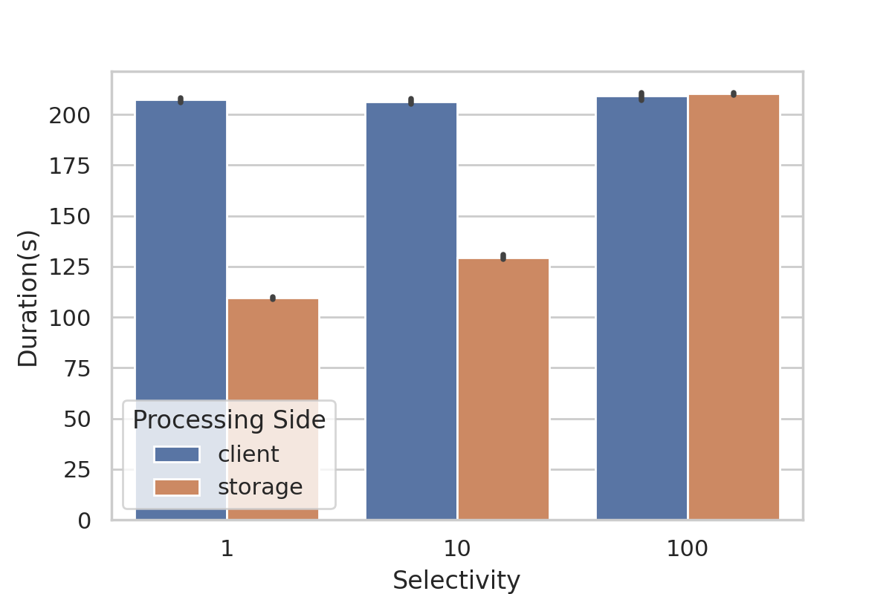

# The Problem and Our Solution {#sec:probsol}

For someone getting started in experimenting with Ceph, it can be a bit overwhelming as there are a lot of steps that one needs to execute and get right before they run some actual experiments and get results. 
In a high-level, the steps that are generally included in a Ceph experimentation workflow are listed below.

* Booting up VMs or Bare metal nodes on Cloud providers like AWS, GCP, CloudLab, etc.
* Deploying Kubernetes and baselining the cluster.
* Compiling and deploying Ceph.
* Baselining the Ceph deployment.
* Running experiments and use-case specific benchmarks.
* Writing Jupyter notebooks and plotting graphs.

If executed manually, these steps can require typing in 100s of commands interactively which is cumbersome and error-prone. 
Since Popper [@popperpaper] is good at automating experimentation workflows following a reproducible approach, we felt that automating this complex scenario can be a good use case for Popper and would lower the entry barrier for new Ceph researchers. 
Using Popper, we coalesced a long list of Ceph experimentation commands and guides into a couple of Popper workflows, that can be easily executed on any machine to perform Ceph experiments, thus automating all the wasteful manual work and allowing researchers to focus on their experimentation logic instead. 
Besides workflows for baselining the Kubernetes and Ceph cluster, we also built workflows to benchmark the performance of SkyhookDM, a library that when added to Ceph allows pushing down queries to the storage and querying tabular data from objects.
We measured the performance gained by pushing down query processing to the storage side and also the overhead of the SkyhookDM layer over vanilla Ceph.

# Background {#sec:background}

## Ceph

Ceph is an open-source software storage platform, implements object storage on a single distributed computer cluster, and provides a 3 in 1 interface for: object, block, and file-level storage. 
Ceph allows decoupling data from physical hardware storage, using software abstraction layers, providing scaling and fault management capabilities. 
This makes Ceph ideal for cloud, Openstack, Kubernetes, and other microservice and container-based workloads as it can effectively address large data volume storage needs.

## SkyhookDM

SkyhookDM is a cloud storage system that leverages "programmable storage" capabilities to enhance data management directly within the storage layer of a distributed object storage system such as Ceph. 
The goal of Skyhook is to allow users to transparently grow and shrink their data storage and processing needs as demands change.  
Skyhook utilizes and extends Ceph distributed object storage with customized C++ "object classes" that enable database operations such as SELECT, PROJECT, AGGREGATE to be offloaded (i.e., pushed down) directly into the object storage layer.  
We are developing custom user-defined functions (UDFs) to enable domain-specific processing as well. 
SkyhookDM also enables data management tasks to be executed directly within storage such as local indexing and data redistribution or reformatting (row/col) to support dynamic data management in the cloud.  
These tasks operate directly on objects at the single object or cross-object level.

## Kubernetes

Kubernetes is a production-grade open-source container orchestration system written in Golang that automates many of the manual processes involved in deploying, scaling, and managing of containerized applications across a cluster of hosts. 
A cluster can span hosts across public, private, or hybrid clouds. 
This makes Kubernetes an ideal platform for hosting cloud-native applications. 
Kubernetes supports a wide range of container runtimes including Docker, Rkt, and Podman. 
It was originally developed and designed by engineers at Google and it is hosted and maintained by the CNCF (Cloud Native Computing Foundation). 
Many cloud providers like GCP, AWS, and Azure provide a completely managed and secure hosted Kubernetes platform.

# Overview of Popper {#sec:popper}

In general, researchers and developers often end up typing a long list of commands in their terminal to build, deploy, and experiment with complex software systems. 
The process is highly manual and needs a lot of expertise or can lead to frustration because of missing dependencies and errors. 
The problem of dependency management can be addressed by moving the entire software development life cycle inside software containers. 
This is known as container-native development. 
In practice, when developers work following the container-native paradigm, they end up interactively executing multiple docker pull|build|run commands in order to build containers, compile code, test applications, deploy software, etc. 
Keeping track of which docker commands were executed, in which order, and which flags were passed to each, can quickly become unmanageable, difficult to document (think of outdated README instructions), and error-prone. 

The goal of Popper is to bring order to this chaotic scenario by providing a framework for clearly and explicitly defining container-native tasks. 
You can think of Popper as a tool for wrapping all these manual tasks in a lightweight, machine-readable, self-documented format (YAML).
While this sounds simple at first, it has significant implications: results in time-savings, improve communication and in general unifies development, testing, and deployment workflows. 
As a developer or user of “Popperized” container-native projects, users need to learn one tool and leave the execution details to Popper, whether is to build and tests applications locally in containers, on a remote CI server, or a Kubernetes cluster.

# Stages of a Ceph experiment

In this section, we discuss how the different stages of a Ceph experiment was automated and made reproducible with Popper.

## Setting Up a Kubernetes Cluster

Managed Kubernetes clusters from Cloud providers like Google Kubernetes Engine from GCP, Elastic Kubernetes Service from AWS, etc. can be used.
If CloudLab, the NSF sponsored experimentation testbed, is accessible, Popper workflows for spawning bare-metal nodes on CloudLab and deploying Kubernetes on them are available. 
The workflows leverage Geni-Lib to programmatically allocate nodes on CloudLab and use Kubespray to setup production-ready Kubernetes clusters. 
In our case, we used the River SSL Kubernetes cluster at UChicago for setting up and benchmarking our Ceph clusters.
Kubernetes clusters should ideally have a monitoring infrastructure setup to monitor several system parameters in real-time and also record them while running experiments. 
We used Prometheus and Grafana to set up monitoring as they are the industry standards and hence wrote workflows for deploying their corresponding operators on a Kubernetes cluster.

## Baselining the Kubernetes Cluster

After a Kubernetes cluster is available, benchmarking the cluster is necessary to have a baseline so that the overheads of the applications deployed on it later can be estimated.
In the case of storage systems, usually the Disks or the Network stack act as the sources of bottlenecks.
So, we implemented workflows to baseline a Kubernetes cluster in terms of the Disk and Network bandwidth of the underlying nodes.
Kubestone, which is a benchmarking operator for Kubernetes, was used in these workflows as it provides operators for running blockdevice tests with `fio` and Network benchmarks using `iperf`. 

The fio benchmark workflow launches client pods on different nodes and benchmarks the R/W bandwidth of the blockdevices while performing parameter sweeps over IO depth, job count, block size, etc. 
The parameter sweeps allow capturing performance variation with different parameters, where the different sets of parameters can be mapped to real workloads while running Ceph benchmarks.
On running this workflow to benchmark the blockdevices in our Kubernetes deployment, the seq. read bandwidth was found to be ~410 MB/s on keeping the CPU busy with 8 fio jobs and an IO depth 32.

{#fig:disk .center height=35% width=50%}

Similarly, the iperf benchmark workflow launches client and server pods on distinct nodes to measure the bandwidth of the link between them.
The link bandwidth between the node that was used as the client and the nodes that were used as the OSDs in our deployment was found to be around 8-8.5 Gb/s.
Although the theoretical bandwidth of the inter-node links was 10 Gb/s, the measured bandwidth was found slightly lower than it due to the overhead of the underlying Kubernetes network stack, which in this case was managed by Calico.

{#fig:network .center height=25% width=50%}

## Benchmarking the Ceph Object Store Interface, RADOS

Ceph was deployed on our Kubernetes cluster using Rook, which is a cloud-native storage orchestrator for Kubernetes to make storage systems self-healing, self-managing and self-scaling. 
Rook deploys and manages the Ceph daemons like OSDs, MONs, etc. as pods. 
Our Ceph deployment comprised of 3 MONs and 4 OSDs, where each OSD was deployed on a distinct node and on a single blockdevice. 
To find out the R/W throughput of the Ceph object store, the overhead it incurs on the raw blockdevices, and the component that becomes the bottleneck, we benchmarked RADOS, the object store interface of Ceph using the `rados bench` utility provided by Ceph.
We ran the benchmarks by reading/writing objects of size 10MB using all the cores of the client. 
We initially began the experiment with a single OSD and gradually scaled it up to 5 OSDs in order to capture the peak throughput and the throughput trend w.r.t OSD count.
The OSD's disk became the bottleneck while running the benchmarks on a single OSD as the throughput was around 390 MB/s, which was not enough to saturate the network.
The RADOS seq. read throughput was found to be slightly less than that of the blockdevice seq. read and this observation can be attributed to the overhead of the Ceph bluestore over the blockdevice.
As shown in @Fig:rados, we observed a significant throughput increase as we scaled out from 1 to 4 OSDs. 

{#fig:rados .center height=25% width=50%}

But when we scaled out to 5 OSDs, the throughput increase was minute and was stagnant at  ~1000 MB/s. 
Since the network bandwidth was around 8–8.5 Gb/s, we immediately realized that the bottleneck has shifted from the storage to the network. 
The CPU usage, memory pressure, and network traffic were also monitored while running the benchmarks. 
Only the link between the client and the OSDs was found to be saturated.

## Case Study: SkyhookDM Benchmarks on River SSL Cluster

{#fig:skyhook .center height=25% width=50%}

The SkyhookDM cluster was benchmarked to find out the performance gained by pushing down query operations to the storage as compared to running queries on the client and also to find out the overhead of the SkyhookDM layer on Ceph.
We updated our vanilla Ceph cluster to a SkyhookDM cluster using a Popper workflow, that updates the Ceph image in the Rook operator and updates the cluster config to load the SkyhookDM tabular libraries.
For this experiment, 10000 objects each of size 10MB containing tabular data in Flatbuffer format were loaded into a pool that had replication disabled. 
The total size of the resulting dataset size was around 210GB and comprised of 750M rows. 
Queries were executed to select 1%, 10%, and 100% of the data with the query execution once on the client and once on the storage.
As shown in @Fig:skyhook, the total time required for querying 1% and 10% of the data was significantly less when queries were pushed down and executed on the storage side. 
This observation was quite expected as only a subset of the rows needed to be transferred through the network in case of push down. 
For the 100% selectivity scenario, since the entire dataset needed to be transferred through the network in both client and storage side processing, there was no performance gain, which we felt was normal.
As the total dataset size was around 210 GB and the time spent in fetching and querying the entire dataset was around 210 s, it can be derived that the throughput was approx. 1000 MB/s i.e. 8 Gb/s, the network limit. 
So, the network was again the bottleneck. 
From @Fig:rados and @Fig:skyhook, the overhead of SkyhookDM while querying the data, was found to be negligible since both vanilla Ceph and SkyhookDM had nearly the same read throughput.

# Conclusion and Future Work

In this report, we discuss how we automated a Ceph experimentation workflow with the help of Popper workflows.
We also present the results obtained from benchmarking a SkyhookDM deployment using the Popper workflows on the River SSL cluster.
We start by describing Popper and how it helps in building automated and reproducible workflows.
We discuss the different stages in a Ceph experimentation workflow and also present and discuss the observations of running the benchmarks on our Ceph and SkyhookDM deployments.

As future work, we aim to add workflows to automate other categories of Ceph benchmarks like CephFS and RBD benchmarks.

<!--
TODO: 
1) introduction
2) Add more to future work
3) Add more details about the workflows
-->

# References {#sec:references}
\footnotesize
